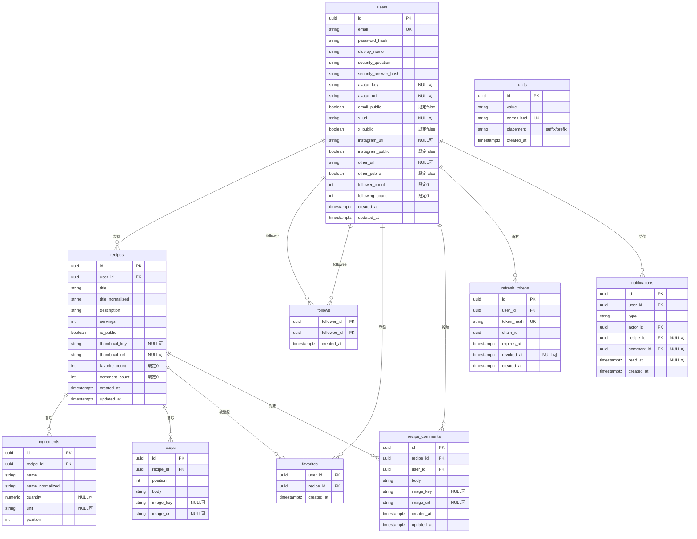

# データモデル（集約ビュー）

> これは全体を一望するための集約ビュー。各カラムの意味・バリデーションは該当する `features/*.md` を正とする。

## ER 図

## テーブル定義・制約・インデックス

| テーブル | 主なカラム / 制約 / インデックス | 詳細 |
| --- | --- | --- |
| `users` | `email` UNIQUE NOT NULL / `password_hash` NOT NULL / `display_name` NOT NULL（1〜30）/ `security_question` NOT NULL / `security_answer_hash` NOT NULL / `avatar_key`・`avatar_url` NULL 可 / `email_public`・`x_public`・`instagram_public`・`other_public` BOOLEAN NOT NULL DEFAULT false / `x_url`・`instagram_url`・`other_url` NULL 可（URL 形式）/ `follower_count`・`following_count` INT NOT NULL DEFAULT 0 CHECK(>= 0) | [features/auth.md](features/auth.md), [features/profile.md](features/profile.md), [features/follow.md](features/follow.md) |
| `recipes` | `user_id` FK → `users.id`（ON DELETE CASCADE）/ `servings` NOT NULL CHECK(1〜99) / `is_public` NOT NULL / `title` NOT NULL（1〜120）/ `title_normalized` NOT NULL（index、必要なら `pg_trgm`）/ `description`（0〜2000）/ `thumbnail_key`・`thumbnail_url` NULL 可 / `favorite_count`・`comment_count` INT NOT NULL DEFAULT 0 CHECK(>= 0) / index(`user_id`) / index(`is_public`, `created_at` DESC) | [features/recipe.md](features/recipe.md) |
| `ingredients` | `recipe_id` FK（ON DELETE CASCADE）/ UNIQUE(`recipe_id`, `position`) / `name` NOT NULL（1〜60）/ `name_normalized` NOT NULL・index（必要なら `pg_trgm`）/ `quantity` NUMERIC NULL・CHECK(quantity > 0) / `unit` VARCHAR NULL（0〜20） | [features/recipe.md](features/recipe.md), [features/search.md](features/search.md), [features/unit.md](features/unit.md) |
| `steps` | `recipe_id` FK（ON DELETE CASCADE）/ UNIQUE(`recipe_id`, `position`) / `body` NOT NULL（1〜1000）/ `image_key`・`image_url` NULL 可 / `position` は 1 起点の連番 | [features/recipe.md](features/recipe.md), [features/image.md](features/image.md) |
| `recipe_comments` | `id` PK / `recipe_id` FK → `recipes.id`（ON DELETE CASCADE）/ `user_id` FK → `users.id`（ON DELETE CASCADE）/ `body` NOT NULL（1〜1000）/ `image_key`・`image_url` NULL 可 / index(`recipe_id`, `created_at` DESC) | [features/comment.md](features/comment.md) |
| `units` | `normalized` UNIQUE NOT NULL / `value` NOT NULL / `placement` NOT NULL DEFAULT `suffix`（`suffix` / `prefix`。`大さじ` `小さじ` のみ `prefix`） | [features/unit.md](features/unit.md) |
| `follows` | PK(`follower_id`, `followee_id`) / 両カラム FK → `users.id`（ON DELETE CASCADE）/ CHECK(`follower_id` <> `followee_id`) / index(`followee_id`) | [features/follow.md](features/follow.md) |
| `favorites` | PK(`user_id`, `recipe_id`) / `user_id` FK → `users.id`（ON DELETE CASCADE）/ `recipe_id` FK → `recipes.id`（ON DELETE CASCADE）/ index(`recipe_id`) | [features/favorite.md](features/favorite.md) |
| `refresh_tokens` | `id` PK / `user_id` FK → `users.id`（ON DELETE CASCADE）/ `token_hash` UNIQUE NOT NULL / `chain_id` NOT NULL / `expires_at` NOT NULL / `revoked_at` NULL 可 / index(`user_id`), index(`chain_id`) | [features/auth.md](features/auth.md) |
| `notifications` | `id` PK / `user_id` FK → `users.id`（ON DELETE CASCADE、受信者）/ `actor_id` FK → `users.id`（ON DELETE CASCADE、行為者）/ `recipe_id` FK → `recipes.id`（ON DELETE CASCADE）NULL 可 / `comment_id` FK → `recipe_comments.id`（ON DELETE CASCADE）NULL 可 / `read_at` NULL 可 / index(`user_id`, `created_at` DESC) / 部分 index(`user_id`) WHERE `read_at IS NULL` | [features/notification.md](features/notification.md) |

> `recipe_images` テーブルは廃止（画像は `recipes.thumbnail_*` と `steps.image_*` に統合）。

## 共通方針

- 主キーは UUID を基本とする（分散生成しやすく、URL に ID を晒しても連番推測されない）。
- `created_at` / `updated_at` は `timestamptz`。アプリ側またはトリガーで更新。
- `*_normalized`（`recipes.title_normalized` / `ingredients.name_normalized` / `units.normalized`）はサーバーが生成する（トリム・小文字化・全角/半角そろえ）。検索（[features/search.md](features/search.md)）と単位の重複判定（[features/unit.md](features/unit.md)）に使う。正規化の具体仕様は → [todo.md](todo.md)。
- `units` の初期データは Flyway のシードマイグレーションで投入する（[features/unit.md](features/unit.md)）。
- パスワード・秘密の答えはハッシュ化して保存（`password_hash` / `security_answer_hash`）。

## カウント列キャッシュ（非正規化カウント）

- 対象列: `users.follower_count` / `users.following_count` / `recipes.favorite_count` / `recipes.comment_count`。
- これらは集計クエリの代わりに保持する非正規化カラム。増減の**運用ルール（トランザクション方針）は [non-functional.md](non-functional.md) を正とする**（このファイルは列の定義のみ）。
- 実数との整合性を担保する補正ジョブを定期実行する。

## アカウント削除時の CASCADE（`DELETE FROM users WHERE id = :me`）

- `recipes`（→ さらに `ingredients` / `steps` / その `recipe` への `favorites` / `recipe_comments` / `notifications`）
- `follows`（`follower_id` = me と `followee_id` = me の両方向）
- `favorites`（`user_id` = me）
- `recipe_comments`（`user_id` = me）
- `refresh_tokens`（`user_id` = me）
- `notifications`（`user_id` = me と `actor_id` = me）
- ストレージ上の画像（サムネ・手順画像・感想画像・アバター）はアプリ側で削除ジョブ対象にする。
- 他ユーザーの `follower_count` / `following_count` / `recipes.favorite_count` などカウント列は、削除処理内で減算するか補正ジョブで整合させる（実装時に確定 → [todo.md](todo.md)）。
- 詳細は [features/profile.md](features/profile.md)。
