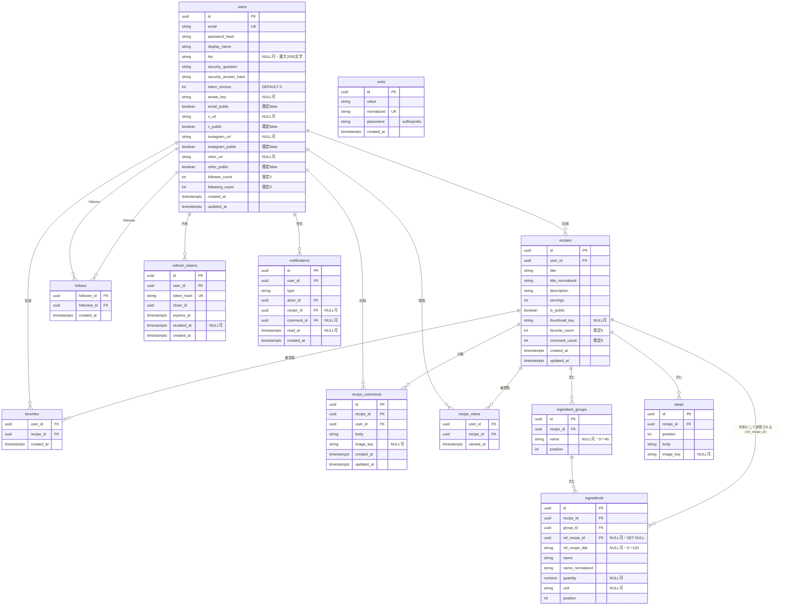

# データモデル（集約ビュー）

> これは全体を一望するための集約ビュー。各カラムの意味・バリデーションは該当する `features/*.md` を正とする。
>
> **実装方針**: テーブルは SQLModel（SQLAlchemy 2.0）で定義し、スキーマ変更は Alembic マイグレーションで管理する（[tech-stack.md](tech-stack.md)）。ただし **DB レベルの制約が正**であり、SQLModel のモデル定義で表現できない制約（複合外部キー、部分インデックス、`CHECK`、トリガー、カウント列のトランザクション方針）は Alembic の手書きマイグレーションで作成する。以下の制約表・CASCADE 方針はすべて DB 側で担保する。

## ER 図

## テーブル定義・制約・インデックス

| テーブル | 主なカラム / 制約 / インデックス | 詳細 |
| --- | --- | --- |
| `users` | `email` UNIQUE NOT NULL / `password_hash` NOT NULL / `display_name` NOT NULL（1〜30）/ `bio` VARCHAR(2000) NULL 可 / `security_question` NOT NULL / `security_answer_hash` NOT NULL / `token_version` INT NOT NULL DEFAULT 0 / `deleted_at` timestamptz NULL 可・index（非 NULL = 退会中）/ `avatar_key` NULL 可 / `email_public`・`x_public`・`instagram_public`・`other_public` BOOLEAN NOT NULL DEFAULT false / `x_url`・`instagram_url`・`other_url` NULL 可（URL 形式・2048 文字まで）/ `follower_count`・`following_count` INT NOT NULL DEFAULT 0 CHECK(>= 0) | [features/auth.md](features/auth.md), [features/profile.md](features/profile.md), [features/follow.md](features/follow.md) |
| `recipes` | `user_id` FK → `users.id`（ON DELETE CASCADE）/ `servings` NOT NULL CHECK(1〜99) / `is_public` NOT NULL / `title` NOT NULL（1〜120）/ `title_normalized` NOT NULL（index、必要なら `pg_trgm`）/ `description`（0〜2000）/ `thumbnail_key` NULL 可 / `favorite_count`・`comment_count` INT NOT NULL DEFAULT 0 CHECK(>= 0) / index(`user_id`) / index(`is_public`, `created_at` DESC) | [features/recipe.md](features/recipe.md) |
| `ingredient_groups` | `id` PK / `recipe_id` FK → `recipes.id`（ON DELETE CASCADE）/ `name` VARCHAR NULL（0〜40。NULL / 空 = 名前なしグループ）/ `position` INT / UNIQUE(`recipe_id`, `position`) / **UNIQUE(`id`, `recipe_id`)**（`ingredients` からの複合 FK の参照先） | [features/recipe.md](features/recipe.md) |
| `ingredients` | `recipe_id` FK → `recipes.id`（ON DELETE CASCADE）/ **複合 FK (`group_id`, `recipe_id`) → `ingredient_groups`(`id`, `recipe_id`)（ON DELETE CASCADE）** — 材料の `recipe_id` が親グループの `recipe_id` と一致することを DB レベルで保証 / UNIQUE(`group_id`, `position`) / `name` NOT NULL（1〜60）/ `name_normalized` NOT NULL・index（必要なら `pg_trgm`）/ `quantity` NUMERIC NULL・CHECK(quantity > 0) / `unit` VARCHAR NULL（0〜20）/ `ref_recipe_id` FK → `recipes.id`（**ON DELETE SET NULL**）NULL 可 / `ref_recipe_title` VARCHAR NULL（0〜120。参照行の目印兼スナップショット）/ CHECK(`ref_recipe_id` <> `recipe_id`。自己参照不可) / index(`ref_recipe_id`) | [features/recipe.md](features/recipe.md), [features/search.md](features/search.md), [features/unit.md](features/unit.md) |
| `steps` | `recipe_id` FK（ON DELETE CASCADE）/ UNIQUE(`recipe_id`, `position`) / `body` NOT NULL（1〜1000）/ `image_key` NULL 可 / `position` は 1 起点の連番 | [features/recipe.md](features/recipe.md), [features/image.md](features/image.md) |
| `recipe_comments` | `id` PK / `recipe_id` FK → `recipes.id`（ON DELETE CASCADE）/ `user_id` FK → `users.id`（ON DELETE CASCADE）/ `body` NOT NULL（1〜1000）/ `image_key` NULL 可 / index(`recipe_id`, `created_at` DESC, `id` DESC) / index(`user_id`) | [features/comment.md](features/comment.md) |
| `units` | `normalized` UNIQUE NOT NULL / `value` NOT NULL / `placement` NOT NULL DEFAULT `suffix`（`suffix` / `prefix`。`大さじ` `小さじ` のみ `prefix`） | [features/unit.md](features/unit.md) |
| `follows` | PK(`follower_id`, `followee_id`) / 両カラム FK → `users.id`（ON DELETE CASCADE）/ CHECK(`follower_id` <> `followee_id`) / index(`followee_id`) | [features/follow.md](features/follow.md) |
| `favorites` | PK(`user_id`, `recipe_id`) / `user_id` FK → `users.id`（ON DELETE CASCADE）/ `recipe_id` FK → `recipes.id`（ON DELETE CASCADE）/ index(`recipe_id`) / index(`user_id`, `created_at` DESC, `recipe_id` DESC)（お気に入り一覧の並び用。Issue #68） | [features/favorite.md](features/favorite.md) |
| `refresh_tokens` | `id` PK / `user_id` FK → `users.id`（ON DELETE CASCADE）/ `token_hash` UNIQUE NOT NULL / `chain_id` NOT NULL / `expires_at` NOT NULL / `revoked_at` NULL 可 / index(`user_id`), index(`chain_id`) | [features/auth.md](features/auth.md) |
| `notifications` | `id` PK / `user_id` FK → `users.id`（ON DELETE CASCADE、受信者）/ `actor_id` FK → `users.id`（ON DELETE CASCADE、行為者）/ `recipe_id` FK → `recipes.id`（ON DELETE CASCADE）NULL 可 / `comment_id` FK → `recipe_comments.id`（ON DELETE CASCADE）NULL 可 / `read_at` NULL 可 / index(`user_id`, `created_at` DESC, `id` DESC) / 部分 index(`user_id`) WHERE `read_at IS NULL` / 部分一意 index(`user_id`, `recipe_id`) WHERE `type = 'followee_new_recipe'` | [features/notification.md](features/notification.md) |
| `recipe_views` | PK(`user_id`, `recipe_id`)（レシピごとに 1 行）/ `user_id` FK → `users.id`（ON DELETE CASCADE）/ `recipe_id` FK → `recipes.id`（ON DELETE CASCADE）/ `viewed_at` timestamptz NOT NULL / index(`user_id`, `viewed_at` DESC) / index(`recipe_id`)（レシピ削除時の CASCADE 用。FK 列は自動 index されない）/ 再閲覧は `INSERT ... ON CONFLICT (user_id, recipe_id) DO UPDATE SET viewed_at = GREATEST(viewed_at, clock_timestamp())`（upsert・単調更新で並行閲覧でも時刻が巻き戻らない）/ カウント列キャッシュには関与しない | [features/view-history.md](features/view-history.md) |
| `notification_outbox`（Phase 8） | `id` PK / `event` NOT NULL（`followee_new_recipe`）/ `recipe_id` NOT NULL FK → `recipes.id`（ON DELETE CASCADE）/ `author_id` NOT NULL FK → `users.id`（ON DELETE CASCADE）/ `created_at` NOT NULL / `processed_at` NULL 可（NULL = 未処理）/ UNIQUE(`event`, `recipe_id`) / index(`processed_at`) / index(`recipe_id`) / index(`author_id`) / 公開レシピ作成トランザクション内で 1 行 INSERT、`BackgroundTasks` ＋ 定期スイープが処理（[processing-model.md](processing-model.md) §7・§9） | [features/notification.md](features/notification.md) |

> `recipe_images` テーブルは廃止（画像は `recipes.thumbnail_*` と `steps.image_*` に統合）。

> 一時アップロードは所有者と使用状態を保持する（例: `uploads` テーブル。状態 `pending` → `stored` → 消費、`user_id`）。キーはアップロード前に行 INSERT で確定し、オブジェクトだけが存在して行が無い状態を作らない（[processing-model.md](processing-model.md) §9）。具体スキーマは Phase 3 で確定（→ [todo.md](todo.md) #32）。

> **ストレージ削除キュー**: 参照から外れたオブジェクトキー（差し替え / 削除された画像）をためて定期バッチで実削除するためのキュー（`pending_storage_deletions`。`delete_after` NULL 可 = この時刻まで実削除しない。Issue #71）。**キューへの登録は参照を外す書き込みと同一トランザクション**、S3 / MinIO への実 DELETE だけが定期バッチ（[processing-model.md](processing-model.md) §5・§9 / [todo.md](todo.md) #32）。

> **通知 fan-out の outbox**: `followee_new_recipe` の配布は、公開レシピ作成トランザクション内で `notification_outbox` に 1 行書き（発火とアトミック）、コミット後に `BackgroundTasks` が配布、落ちた分を定期スイープが回収する（Phase 8。[processing-model.md](processing-model.md) §7・§9、[features/notification.md](features/notification.md)）。

> **定期バッチが掃除するもの**（Issue #72 で実装）: 全トークンが期限切れから 30 日を過ぎたチェーンの `refresh_tokens`、既読から 90 日を過ぎた `notifications` と処理済みから 7 日を過ぎた `notification_outbox`、1 ユーザー 200 件を超えた `recipe_views`。掃除用の索引: `refresh_tokens(chain_id, expires_at)`（単独の `chain_id` 索引を置き換え）、`notifications(read_at) WHERE read_at IS NOT NULL`。方針は [processing-model.md](processing-model.md) §8、頻度・保持期間は [todo.md](todo.md)。

## 共通方針

- 主キーは UUID を基本とする（分散生成しやすく、URL に ID を晒しても連番推測されない）。
- `created_at` / `updated_at` は `timestamptz`。アプリ側またはトリガーで更新。
- `*_normalized`（`recipes.title_normalized` / `ingredients.name_normalized` / `units.normalized`）はサーバーが生成する（トリム・小文字化・全角/半角そろえ）。検索（[features/search.md](features/search.md)）と単位の重複判定（[features/unit.md](features/unit.md)）に使う。正規化の具体仕様は → [todo.md](todo.md)。`ingredient_groups.name` と `ingredients.ref_recipe_title` は正規化しない（検索対象外）。
- **材料グループ**: レシピは 1 個以上の `ingredient_groups` を持つ（グループ未使用のレシピ = 名前なしグループ 1 つ）。各グループは 1 個以上の `ingredients` を持つ。`ingredients.position` はグループ内の 1 起点連番。詳細は [features/recipe.md](features/recipe.md)。
- **材料のレシピ参照**: `ingredients.ref_recipe_id` が非 NULL の行は「別レシピへのリンク付き材料」。指定できるのはそのレシピの投稿者本人が所有するレシピのみ（自己参照不可）。参照先が削除されると `ref_recipe_id` は SET NULL になり、`ref_recipe_title`（スナップショット）だけが残る。詳細は [features/recipe.md](features/recipe.md)。
- `units` の初期データは Alembic のシードマイグレーションで投入する（[features/unit.md](features/unit.md)）。
- **AI 校正**（[features/ai-proofread.md](features/ai-proofread.md)・Phase 11）は新規テーブル必須ではない。レート制限は当面アプリ内カウンタでも可。使用回数 / コスト追跡用の `ai_usage`（`user_id` / `date` / `count` 等）を持つかは → [todo.md](todo.md)。
- パスワード・秘密の答えはハッシュ化して保存（`password_hash` / `security_answer_hash`）。
- リフレッシュトークンの検証用データは `token_hash` で保持する。
- 画像は `avatar_key` / `thumbnail_key` / `image_key` を正として永続化し、表示用 URL はレスポンス構築時にキーから生成する。本番は非公開 S3 バケットと CloudFront の OAC を組み合わせ、CloudFront のドメインを基底にした安定 URL を返す。ローカル開発・テストは MinIO の公開バケットで安定 URL を返す。いずれも URL はキーから組み立てる派生値として扱い、DB には永続化しない（[features/image.md](features/image.md)）。

## カウント列キャッシュ（非正規化カウント）

- 対象列: `users.follower_count` / `users.following_count` / `recipes.favorite_count` / `recipes.comment_count`。
- これらは集計クエリの代わりに保持する非正規化カラム。増減の**運用ルール（トランザクション方針）は [non-functional.md](non-functional.md) を正とする**（このファイルは列の定義のみ）。処理方式全体は [processing-model.md](processing-model.md)。
- 実数との整合性を担保する補正ジョブを定期実行する（cron 起動の管理 CLI コマンド。[processing-model.md](processing-model.md) §8）。

## アカウント退会（論理削除）

- `DELETE /users/me` は `users` 行を消さず、`deleted_at` を設定する。公開・非公開を問わず投稿レシピ、材料、手順、アバターは残す。
- 退会中は認証依存性が拒否するため、本人の非公開レシピも見られない。公開レシピは残り、API の `RecipeAuthor` は `displayName: "アカウント削除済み"`、`avatarUrl: null`、`isDeleted: true` を返す。
- 同一トランザクションで、本人が起点の `follows`（両方向）・`favorites`・`recipe_comments`・`refresh_tokens`・`notifications`・`recipe_views`・未使用 `uploads`・通知 outbox を明示削除する。残る他ユーザー・レシピのカウント列もこの時点で補正する。
- 画像削除キューへ入れるのは消える本人の感想画像と未使用アップロードのみ。レシピ画像・アバター・他ユーザーの感想画像は保持する。
- 再開は `deleted_at = NULL` に戻すだけで、残ったプロフィール・レシピを復帰する。削除済みの関係行は復元しない。
- 詳細は [features/profile.md](features/profile.md)。
