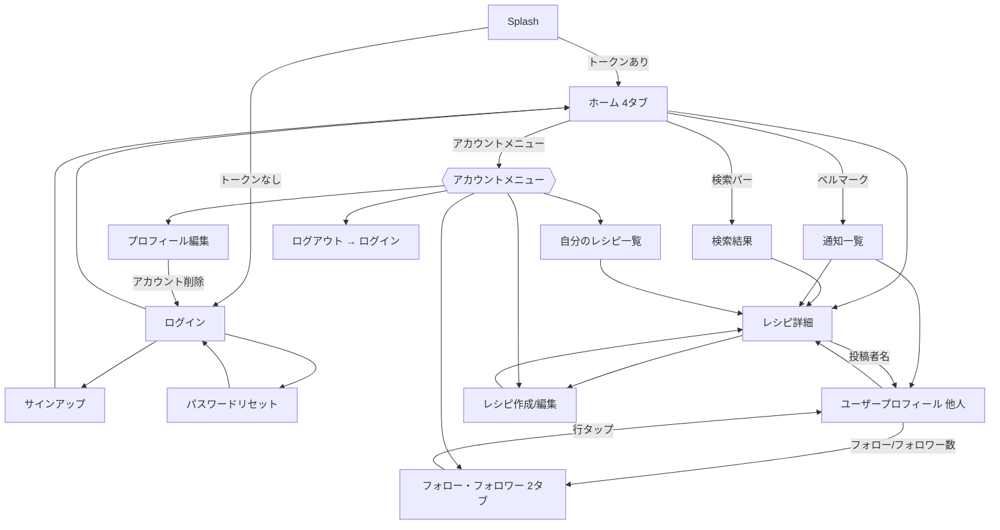

# 画面要件（全体）

各機能に固有の画面詳細は該当 `features/*.md` にも記載する。ここでは画面の全体像・共通コンポーネント・遷移を扱う。

## 共通コンポーネント

### トップアプリバー

ログイン後のホーム画面上部に固定表示。

- 左〜中央: **常時表示の検索入力欄**（プレースホルダ「レシピ・材料で検索」）。確定で検索結果画面へ。詳細は [features/search.md](features/search.md)。
- 右: **通知ベルアイコン**（未読があれば件数バッジ。タップで通知一覧画面。[features/notification.md](features/notification.md)）＋ **アカウントアイコン / 表示名**（タップでアカウントメニュー）。

アカウントメニューの項目:

1. レシピを追加 → レシピ作成画面
2. 自分のレシピ一覧
3. フォロー・フォロワー（2 タブ画面）
4. プロフィール編集
5. ログアウト（`POST /auth/logout` → トークン破棄 → ログイン画面）

> - **お気に入りレシピ**はアカウントメニューではなく、ホームの「お気に入りレシピ」タブ。
> - **アカウント削除**はアカウントメニューではなく、プロフィール編集画面内のボタン。

### レシピカード

一覧画面（ホーム / 検索結果 / 自分のレシピ一覧 / ユーザープロフィール）で 1 レシピを表す共通表示。

- サムネイル画像（`recipes.thumbnail_url`。無ければプレースホルダ）
- タイトル（1〜2 行で省略）
- 投稿者（アバター + 表示名）
- お気に入り数（♡ + 数値。`recipes.favorite_count`）
- （自分のレシピ一覧のみ）非公開バッジ

### ユーザー行

フォロー・フォロワー画面などでユーザー 1 人を表す共通表示。

- アバター + 表示名
- フォロー状態ボタン（「フォロー」/「フォロー中」）
- 行タップでそのユーザーのプロフィールへ

## 画面一覧

| 画面 | 目的 | 認証 | 詳細 |
| --- | --- | --- | --- |
| スプラッシュ | 起動時。トークン有無で遷移先を分岐 | - | 下記 |
| ログイン | メール + パスワードでログイン | 不要 | [features/auth.md](features/auth.md) |
| サインアップ | 新規登録（秘密の質問を含む） | 不要 | [features/auth.md](features/auth.md) |
| パスワードリセット | 秘密の質問で本人確認 → 新パスワード | 不要 | [features/auth.md](features/auth.md) |
| ホーム | 4 タブのフィード + 検索 + 通知 + アカウントメニュー | 必要 | [features/home-feed.md](features/home-feed.md) |
| 検索結果 | 検索語での結果一覧 | 必要 | [features/search.md](features/search.md) |
| 通知一覧 | 自分あての通知 | 必要 | [features/notification.md](features/notification.md) |
| レシピ詳細 | レシピを見る + お気に入り + 感想 | 任意（非公開は本人のみ） | [features/recipe.md](features/recipe.md), [features/comment.md](features/comment.md) |
| レシピ作成 / 編集 | レシピの入力・行編集・画像 | 必要 | [features/recipe.md](features/recipe.md) |
| 自分のレシピ一覧 | 本人の公開 / 非公開レシピ | 必要 | [features/recipe.md](features/recipe.md) |
| フォロー・フォロワー | 2 タブ（フォロー中 / フォロワー） | 必要 | [features/follow.md](features/follow.md) |
| プロフィール編集（自分） | 表示名 / アバター / SNS / アカウント削除 | 必要 | [features/profile.md](features/profile.md) |
| ユーザープロフィール（他人） | 表示名・フォロー・その人のレシピ | 必要 | [features/profile.md](features/profile.md) |

> お気に入りレシピは独立画面ではなく、ホームの「お気に入りレシピ」タブ（[features/home-feed.md](features/home-feed.md)）。

## 画面ごとのレイアウト

各画面「主要コンポーネント（上→下）/ 主な遷移 / 空・エラー状態」。

### スプラッシュ

- ロゴ表示。保存済みトークンがあり自動再ログインに成功すればホームへ、無ければログインへ（[features/auth.md](features/auth.md)「ログインを保持」）。

### ログイン

- メール入力 / パスワード入力（表示トグル）/ **「ログインを保持」チェックボックス** / ログインボタン / 「パスワードをお忘れの方」リンク / 「新規登録」リンク
- エラー: 認証失敗時に「メールアドレスまたはパスワードが違います」

### サインアップ

- メール / パスワード（表示トグル）/ パスワード確認（表示トグル・不一致はクライアントでエラー、送信ブロック）/ 表示名 / **秘密の質問（質問文の自由入力 + 答え）** / 登録ボタン / 「ログインへ」リンク
- エラー: メール重複（409）「このメールアドレスは登録済みです」

### パスワードリセット

1. メールアドレス入力 → 送信
2. 登録済みの質問文を表示
3. 答えを入力 → 送信
4. 新しいパスワード + 確認（表示トグル・一致チェック）→ 更新 → ログイン画面へ
- エラー: 答え不一致 / 試行回数超過（429）

### ホーム

- トップアプリバー（検索バー + 通知ベル + アカウントメニュー）
- タブ: 全体 / フォロー / フォロワー / お気に入りレシピ
- 本文: レシピカードの縦リスト（無限スクロール）
- レシピ作成導線（FAB またはアカウントメニュー）
- 空状態: 各タブのメッセージは [features/home-feed.md](features/home-feed.md)

### 検索結果

- 上部: 検索語チップ + 現在のフィード表示
- 本文: レシピカードの縦リスト
- 空状態: 「『〇〇』に一致するレシピは見つかりませんでした」

### 通知一覧

- 通知を新しい順に表示（無限スクロール）。未読は強調。
- 各行: 行為者アバター + 本文 + 日時。行タップで対象へ遷移し既読化。
- 「すべて既読にする」操作。
- 空状態: 「通知はまだありません」

### レシピ詳細

上から順に:

1. **サムネイル画像 1 枚**（無ければプレースホルダ）。※ 画像カルーセルは無い
2. タイトル
3. 投稿者行（アバター + 表示名 + フォローボタン。タップでユーザープロフィール）
4. メタ情報（何人分・投稿日）
5. ♡ ボタン + お気に入り数
6. 説明
7. 材料リスト（材料名 ＋ 数量・単位。単位の前置 / 後置は [features/unit.md](features/unit.md) の表示ルール。例: `じゃがいも 3 個` / `砂糖 大さじ 2` / `塩 少々`）
8. 手順リスト（番号付き。各手順は本文 ＋ その手順の画像があれば画像を縦に表示）
9. 感想セクション: 感想を書く入力欄 + 画像添付ボタン + 送信ボタン（レシピ投稿者本人には非表示）／ 感想一覧（投稿者行 + 本文 + 添付画像 + 投稿日、自分の感想には編集 / 削除、レシピ投稿者には各感想に削除）。**カーソルページングによる無限スクロール**
- 本人が見ている場合: 画面上部に「編集」「削除」

### レシピ作成 / 編集

- サムネイル画像選択（1 枚、変更 / 削除）
- タイトル / 説明 / 何人分
- 材料の行リスト（行追加 / 削除 / 並べ替え、単位オートコンプリート。入力中に `大さじ 2` などのプレビュー表示）
- 手順の行リスト（本文 ＋ 各行に「画像を追加」ボタン、行追加 / 削除 / 並べ替え）
- 公開フラグ
- 詳細は [features/recipe.md](features/recipe.md)

### 自分のレシピ一覧

- レシピカードの 1 リスト（公開・非公開混在、非公開に「非公開」バッジ）
- 空状態: 「まだレシピを投稿していません」

### フォロー・フォロワー

- 上部タブ: 「フォロー中」「フォロワー」
- 各タブ: ユーザー行のリスト（無限スクロール）
- 行タップ → ユーザープロフィール
- 空状態: それぞれ「まだ誰もフォローしていません」「まだフォロワーがいません」

### ユーザープロフィール（他人）

1. アバター + 表示名
2. フォロー数 / フォロワー数（タップでフォロー・フォロワー画面の該当タブへ）
3. フォローボタン（フォロー / フォロー中）
4. 連絡先・SNS（公開トグル ON の項目のみ: メール / X / Instagram / その他 URL）
5. その人の公開レシピ一覧（レシピカード）

### プロフィール編集（自分）

1. アバター画像（変更 / 削除）
2. 表示名
3. メールアドレス（値の表示 + 「プロフィールに表示する」トグル）
4. X の URL（+ トグル）
5. Instagram の URL（+ トグル）
6. その他の URL（+ トグル）
7. 保存ボタン
8. （区切り線）
9. **アカウント削除**ボタン（赤色）。タップで確認ダイアログ →（本文で警告）→ 実行で全データ削除 → ログイン画面へ

## 画面遷移図

## マルチプラットフォーム UX 方針

対象は Android / iOS / Desktop（Windows・macOS）。同一の Compose UI を全プラットフォームで表示する（[tech-stack.md](tech-stack.md) / [architecture.md](architecture.md)）。

- **モバイル**: 片手操作を前提に、主要アクション（保存・追加）は画面下部に配置する。画像は端末のカメラ / ギャラリーから選択。
- **デスクトップ**: 画像は OS のファイル選択ダイアログから。キーボード操作（Tab 移動、Enter 送信）とマウスに配慮。ウィンドウはリサイズ可能。一覧・本文は最大幅を設けて広い画面でも読みやすくする。ウィンドウ最小サイズは実装時に確定（→ [todo.md](todo.md)）。2 ペイン表示（一覧＋詳細を横並び）は将来検討（→ [todo.md](todo.md)）。
- 材料・手順はその場で行を追加 / 削除 / 並べ替えできる（[features/recipe.md](features/recipe.md)）。
- 単位欄は自由入力しつつ、既存単位の候補を補完表示する（[features/unit.md](features/unit.md)）。
- **一覧・感想スレッドはすべてカーソルページングによる無限スクロール**（[non-functional.md](non-functional.md)）。
- 下書き保持・オフライン対応・ブラウザ（Web）版は対象外（→ [todo.md](todo.md)）。
