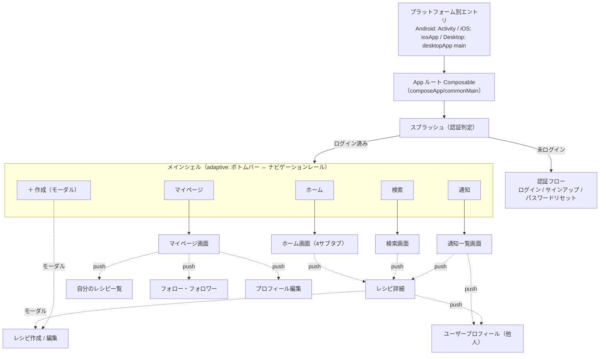
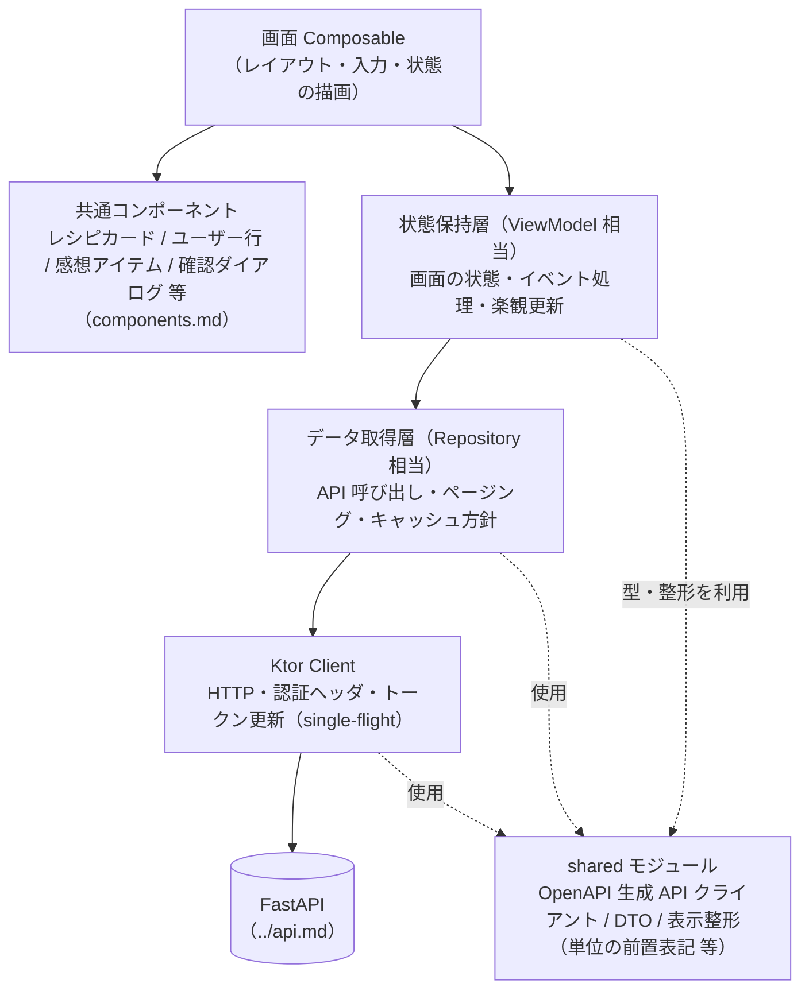

# ナビゲーション構造

## 方針

- **モバイル（コンパクト幅）**: 画面下部に**ボトムナビゲーション**（5 destination）。
- **デスクトップ / タブレット（中〜広幅）**: 画面左に**ナビゲーションレール**（同じ 5 destination）。
- 同一の Compose UI で、ウィンドウ幅のブレークポイントに応じて adaptive に切り替える（compact = ボトムバー、medium / expanded = レール）。ブレークポイントの具体値は実装時に確定（→ [`../todo.md`](../todo.md)）。
- 現行案の「上部バーに検索バー常駐 + アカウントメニュー」は廃止。検索は独立 destination、アカウント関連は「マイページ」destination に集約する。

## 5 つの destination

| destination | 画面 | 説明 |
| --- | --- | --- |
| ホーム | [home.md](home.md) | 4 サブタブ（全体 / フォロー / フォロワー / お気に入りレシピ）のフィード |
| 検索 | [search.md](search.md) | 画面上部に常時表示の検索フィールド ＋ 結果一覧 |
| ＋（作成） | [recipe-editor.md](recipe-editor.md) | タップでレシピ作成画面をフルスクリーンダイアログ（モーダル）で開く。タブ自体は選択状態にしない |
| 通知 | [notifications.md](notifications.md) | 通知一覧。未読があればアイコンにバッジ |
| マイページ | [my-page.md](my-page.md) | 自分のプロフィール概要 ＋ メニュー |

- 「＋」はモーダル起動なので、閉じると直前の destination に戻る。
- 「通知」バッジの数は `GET /notifications/unread-count`（または一覧レスポンスの `unreadCount`）。既読化で減る。

## 画面の実装レイヤー

> 状態管理 / DI / ナビゲーションの具体ライブラリは未確定（→ [`../todo.md`](../todo.md)）。ここでは役割レベルの構造を示す。名称は「相当」（例: ViewModel 相当 = 画面の状態を保持し再構成に耐える層）。

### ナビゲーション階層

- 認証フローとメインシェルは別スタック。ログイン成功でメインシェルに差し替え（認証フローは履歴に残さない）。
- 各 destination は独立したスタックを持ち、`push` は現在の destination のスタックに積む（[バックスタック](#バックスタック)）。
- 破線 `モーダル` はスタックに積まないフルスクリーンダイアログ。

### 1 画面の内部レイヤー（共通）

- **状態保持層**: 画面ごとに 1 つ。API レスポンス（`shared` の DTO）を画面表示用の状態に変換して保持。♡ やフォローの楽観更新もここ。
- **データ取得層**: エンドポイント単位のまとまり。カーソルページング（[`../non-functional.md`](../non-functional.md)）の cursor 管理もここ。
- **Ktor Client**: アクセストークン付与、401 時のリフレッシュ（single-flight）、`token_version` 不一致でのログアウト誘導（[`../features/auth.md`](../features/auth.md)）。
- **`shared` モジュール**: OpenAPI（FastAPI が出力）から生成した API クライアント / DTO と、フロント内部の表示整形ロジックを置く（[`../architecture.md`](../architecture.md)、[`../tech-stack.md`](../tech-stack.md)）。

## バックスタック

- **destination ごとに独立したナビゲーションスタック**を保持する。タブを切り替えても各タブの位置は保たれる。
- 既に選択中の destination をもう一度タップ → そのタブのスタックをルートまで戻す（先頭がリストなら最上部へスクロール）。
- Android の戻るキー / デスクトップの戻る操作: 現在のタブのスタックを 1 つ戻す。ルートで戻る → ホーム destination へ。ホームのルートで戻る → アプリ終了確認（プラットフォーム標準）。
- **モーダル**（レシピ作成 / 編集、確認ダイアログ、画像ピッカー）はスタックに積まず、閉じると元の画面に戻る。

## 認証ゲート

- **当面、アプリの全画面（スプラッシュ / ログイン / サインアップ / パスワードリセットを除く）はログイン必須**とする。5 destination とそこから開く画面（レシピ詳細を含む）すべてが対象。
  - `GET /recipes/{id}` は API 仕様上は公開レシピを匿名でも返せる（[`../features/recipe.md`](../features/recipe.md)）が、当面のクライアントはこの匿名アクセスを使わない（将来の共有リンク / Web 版のために API 側の余地として残す）。
- 未ログインで保護画面に到達しようとしたら、ログイン画面へ差し替える。
- ログイン / サインアップ成功後、**元々行こうとしていた画面**があればそこへ、なければホームへ。
- スプラッシュ（[splash.md](splash.md)）で「ログインを保持」による自動再ログインを試み、成否で分岐。
- アクセストークンが `token_version` 不一致 / ユーザー不在で 401（アカウント削除・パスワードリセット後）→ ローカルのトークンを破棄しログイン画面へ（[`../features/auth.md`](../features/auth.md)）。

## ディープリンク（アプリ内）

- **通知タップ** → 対象へ:
  - `followed` → その行為者の[ユーザープロフィール](user-profile.md)
  - `recipe_favorited` / `recipe_commented` / `followee_new_recipe` → [レシピ詳細](recipe-detail.md)
- 遷移時にその通知を既読化する。
- 削除済み対象の通知はサーバーが一覧から除外する（[`../features/notification.md`](../features/notification.md)）。取得後・タップ前に削除された稀なケースは遷移先で 404 → 「表示できません」→ 一覧へ戻す。
- 外部ディープリンク（URL スキーム / ユニバーサルリンク）は対象外（→ [`../todo.md`](../todo.md)）。

## トップアプリバー（各画面固有）

グローバルなアプリバーは廃止。各画面が必要に応じて薄いアプリバーを持つ:

- タイトル（画面名 or 文脈。ホームはロゴ）
- 戻る矢印（スタックの 2 階層目以降）
- 文脈アクション（例: レシピ詳細の「編集 / 削除」、レシピ作成の「保存」）

詳細は各画面ファイルの「レイアウト」。

## プラットフォーム差分

| | モバイル | デスクトップ |
| --- | --- | --- |
| 主ナビ | 画面下部のボトムナビ | 画面左のナビゲーションレール |
| ＋（作成） | ボトムナビ中央 | レール内。フルスクリーンではなく大きめのダイアログでも可（実装時に確定） |
| 戻る | OS の戻るキー / スワイプ + アプリバーの戻る矢印 | アプリバーの戻る矢印 + キーボード（Esc でモーダルを閉じる） |
| 一覧幅 | 画面幅いっぱい | 最大幅を設けて中央寄せ。2 ペイン（一覧 + 詳細）は将来検討（→ [`../todo.md`](../todo.md)） |

## UX 方針（全画面共通）

- **モバイル**: 片手操作を前提に、主要アクション（保存・送信・追加）は画面下部に寄せる。画像は端末のカメラ / ギャラリーから。
- **デスクトップ**: キーボード操作（Tab 移動、Enter 送信、Esc でモーダルを閉じる）とマウスに配慮。画像は OS のファイル選択ダイアログ。ウィンドウはリサイズ可能。
- **一覧・感想スレッドはすべてカーソルページングによる無限スクロール**（[`../non-functional.md`](../non-functional.md)）。
- 破壊的操作の前に[確認ダイアログ](components.md)。
- 下書き保持・オフライン対応・ブラウザ（Web）版は対象外（→ [`../todo.md`](../todo.md)）。
