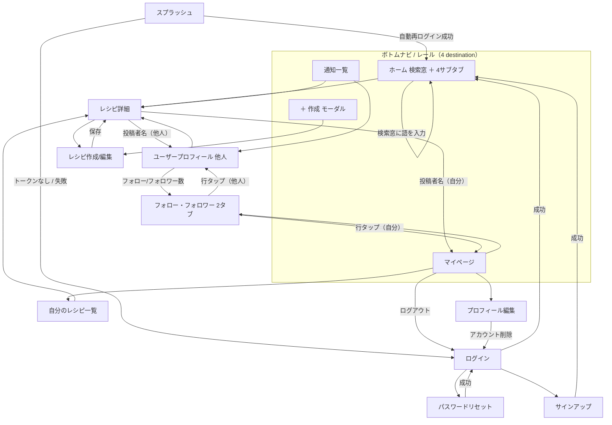
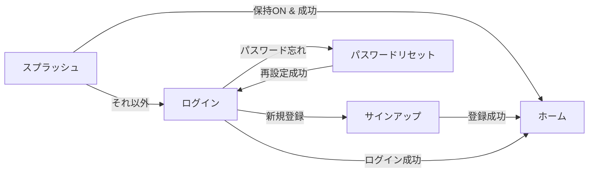
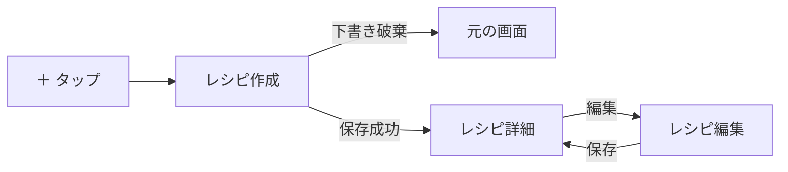
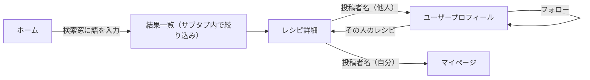
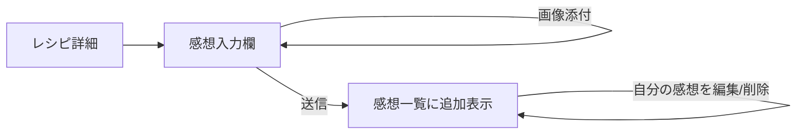
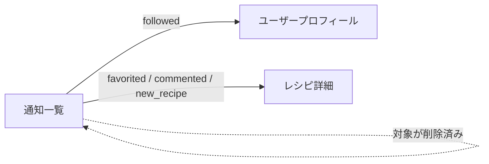
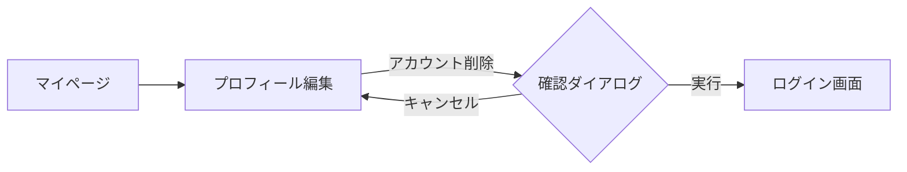

# 画面遷移

全体像は下の Mermaid 図、詳細な入口 / 出口は各画面ファイルの「ナビゲーション」節を正とする。

## 全体遷移図

```mermaid
flowchart TD
    Splash[スプラッシュ]
    Splash -->|自動再ログイン成功| Home
    Splash -->|トークンなし / 失敗| Login[ログイン]

    Login --> Signup[サインアップ]
    Login --> PwReset[パスワードリセット]
    Login -->|成功| Home
    Signup -->|成功| Home
    PwReset -->|成功| Login

    subgraph BottomNav[ボトムナビ / レール（4 destination）]
      Home[ホーム 検索窓 ＋ 4サブタブ]
      Create[＋ 作成 モーダル]
      Notif[通知一覧]
      MyPage[マイページ]
    end

    Home -->|検索窓に語を入力| Home
    Home --> Detail[レシピ詳細]
    Notif --> Detail
    Notif --> UserProfile[ユーザープロフィール 他人]
    MyPage --> MyRecipes[自分のレシピ一覧]
    MyPage --> Connections[フォロー・フォロワー 2タブ]
    MyPage --> ProfileEdit[プロフィール編集]
    MyPage -->|ログアウト| Login

    Detail --> Editor[レシピ作成/編集]
    Create --> Editor
    Editor -->|保存| Detail
    Detail -->|投稿者名（他人）| UserProfile
    Detail -->|投稿者名（自分）| MyPage
    MyRecipes --> Detail
    UserProfile --> Detail
    UserProfile -->|フォロー/フォロワー数| Connections
    Connections -->|行タップ（他人）| UserProfile
    Connections -->|行タップ（自分）| MyPage
    ProfileEdit -->|アカウント削除| Login
```

## フロー別

### オンボーディング

```mermaid
flowchart LR
    A[スプラッシュ] -->|保持ON & 成功| H[ホーム]
    A -->|それ以外| L[ログイン]
    L -->|新規登録| S[サインアップ]
    S -->|登録成功| H
    L -->|ログイン成功| H
    L -->|パスワード忘れ| P[パスワードリセット]
    P -->|再設定成功| L
```

### レシピ投稿

```mermaid
flowchart LR
    N[＋ タップ] --> E[レシピ作成]
    E -->|下書き破棄| back[元の画面]
    E -->|保存成功| D[レシピ詳細]
    D -->|編集| E2[レシピ編集]
    E2 -->|保存| D
```

### 検索 → フォロー

```mermaid
flowchart LR
    H[ホーム] -->|検索窓に語を入力| SR[結果一覧（サブタブ内で絞り込み）]
    SR --> D[レシピ詳細]
    D -->|投稿者名（他人）| U[ユーザープロフィール]
    D -->|投稿者名（自分）| M[マイページ]
    U -->|フォロー| U
    U -->|その人のレシピ| D
```

### 感想投稿

```mermaid
flowchart LR
    D[レシピ詳細] --> C[感想入力欄]
    C -->|画像添付| C
    C -->|送信| D2[感想一覧に追加表示]
    D2 -->|自分の感想を編集/削除| D2
```

### 通知から対象へ

```mermaid
flowchart LR
    T[通知一覧] -->|followed| U[ユーザープロフィール]
    T -->|favorited / commented / new_recipe| D[レシピ詳細]
    T -.->|対象が削除済み| T
```

### アカウント削除

```mermaid
flowchart LR
    M[マイページ] --> PE[プロフィール編集]
    PE -->|アカウント削除| Dlg{確認ダイアログ}
    Dlg -->|キャンセル| PE
    Dlg -->|実行| L[ログイン画面]
```
